# Application Flow & Architecture 🌊

This document details the exact sequence of events that occurs when the Production Schedule Dashboard is loaded and running.

## 1. Initial Page Load (Server-Side Rendering)

When a browser navigates to the dashboard URL:

**Why this matters:** The browser receives a fully formed HTML page with all the production data already inside it. There is no "loading spinner" while the browser waits to fetch data. This ensures the fastest possible Time to First Byte (TTFB) and Largest Contentful Paint (LCP).

## 2. Background Auto-Refresh Lifecycle

Once the page is loaded, it needs to stay up-to-date forever without the user pressing F5. 

```mermaid
sequenceDiagram
    autonumber
    participant Browser as 🖥️ Browser (AutoRefresher)
    participant Next as ⚙️ Next.js Server / API

    Note over Browser: System waits for 300 seconds (5 min)
    Browser->>Next: router.refresh() (Background fetch)
    Next->>Next: Re-run DashboardPage & API fetch
    Next-->>Browser: Return React Server Component Payload (RSC)
    Note over Browser: React reconciles changes gracefully
    Browser->>Browser: Update UI elements (Quantities, New Jobs)
    Note over Browser: Scroll position remains intact!
    Note over Browser: Countdown Timer resets to 05:00
```

**Why this matters:** Using `router.refresh()` instead of `<meta http-equiv="refresh">` or `window.location.reload()` means the browser doesn't have to re-download the CSS, JavaScript, or Fonts. It only downloads the *data changes*. This prevents the screen from flashing white (flickering) and prevents the AutoScroller from jumping back to the top abruptly.

## 3. Manual Sync Flow ("SYNC DATA NOW")

If a production manager needs to force an update instantly:

1. User clicks the **"SYNC DATA NOW"** button.
2. The `SyncNowButton` component triggers `window.location.reload()`.
3. The browser abruptly reloads the page.
4. Because the `/api/schedule` endpoint uses `export const dynamic = 'force-dynamic'`, the Next.js server **ignores all caches** and executes a brand new, live SQL query.
5. The screen paints the absolute latest data from that exact second.

## 4. Hardware Interaction Flow (AutoScroller)

The dashboard is designed to scroll automatically but pausing when someone wants to read it.

By decoupling the scroll logic into `requestAnimationFrame` and separating the "Read DOM" and "Write DOM" phases, the AutoScroller achieves a buttery smooth 60fps without triggering "Layout Thrashing" (Forced Reflows) that would normally cripple a low-spec smart TV browser.
